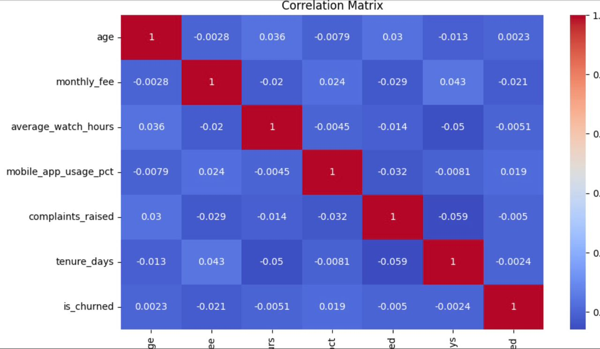
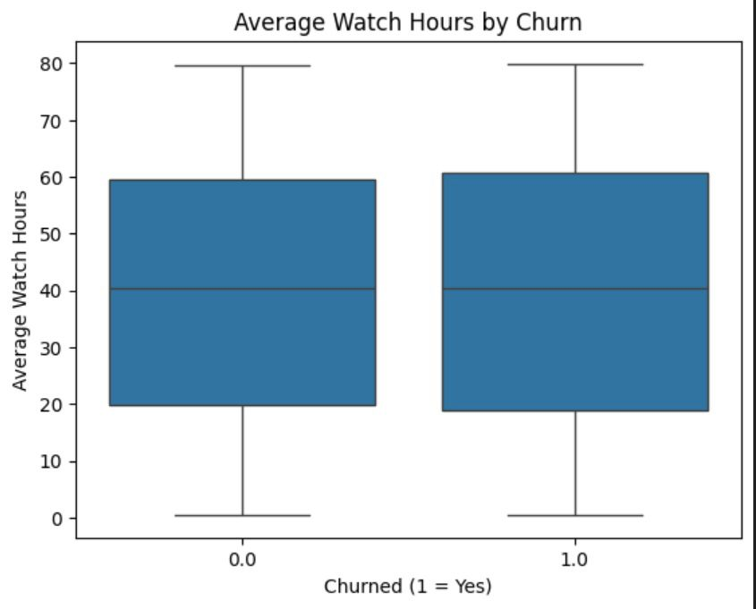
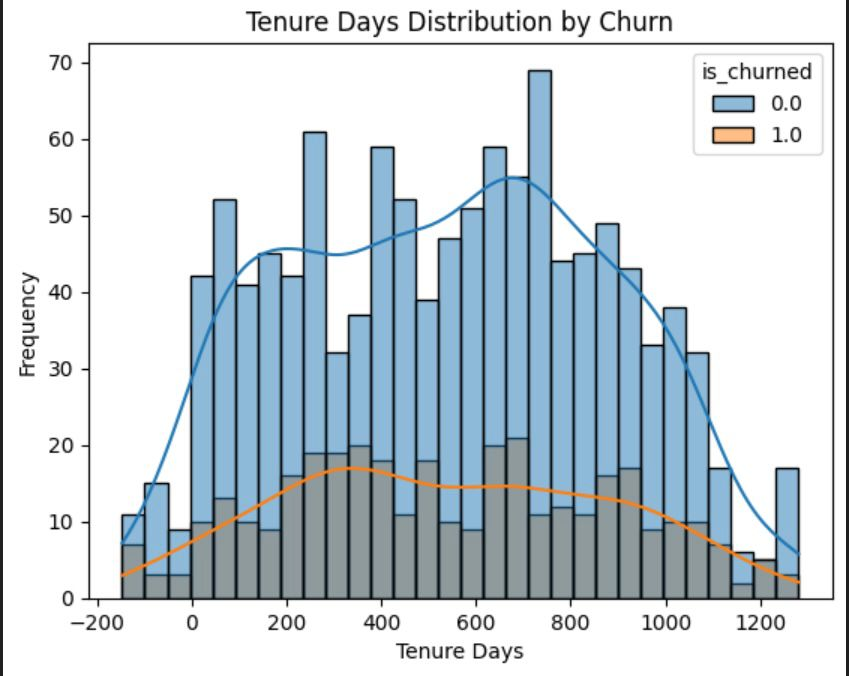
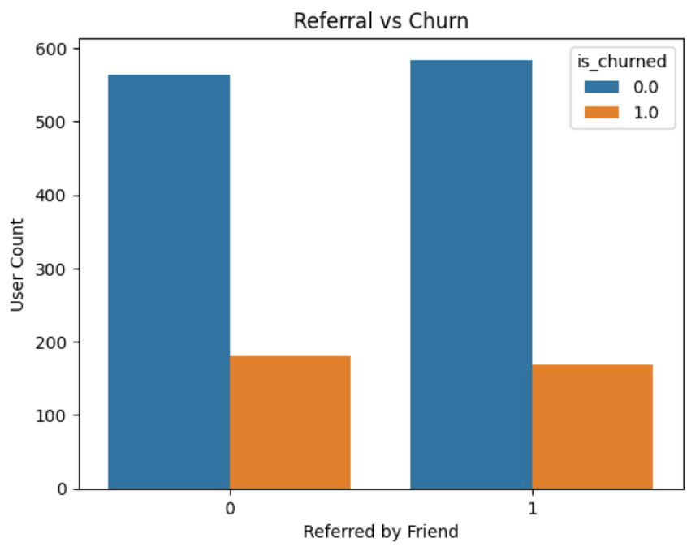
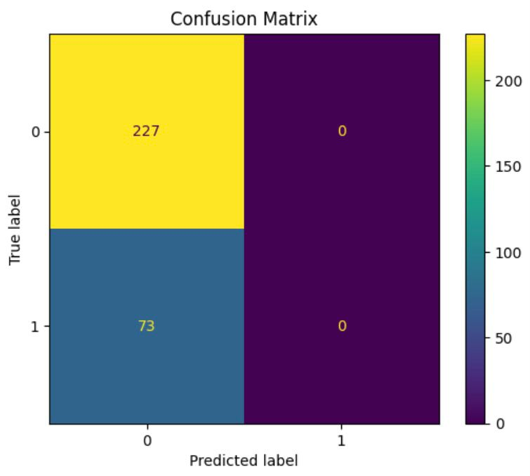
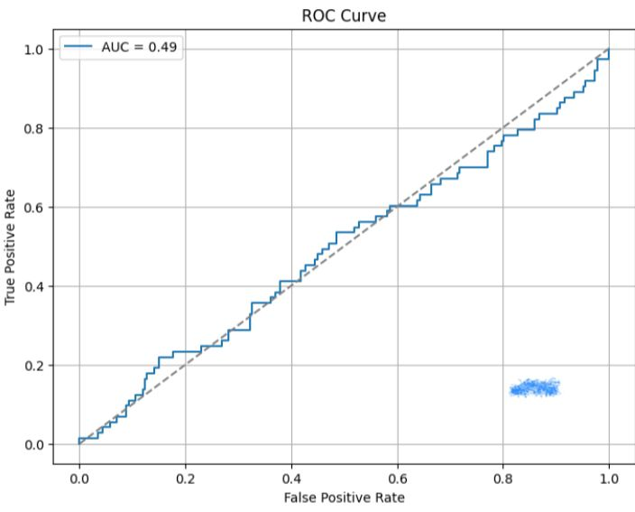
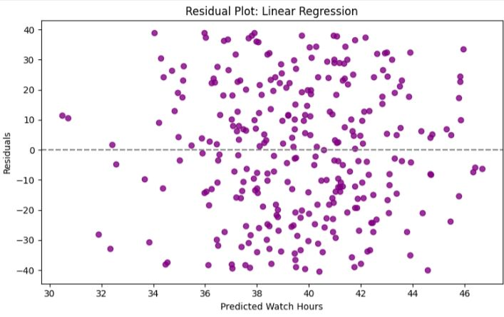

# Churn-Prediction-Streamworks-Media

# Project Overview
This project analyzes user behaviour data and built predictive models to identify the key drivers of churn and engagement for Streamworks Media. It leverages data analytics and machine learning techniques to provide actionable insights and improve user retention

# Business Objective  
- Build a predictive model to identify users likely to churn.  
- Understand the factors influencing customer retention and engagement.  
- Provide actionable recommendations to improve loyalty and reduce churn.  

# Project Files  
- [Raw Data](data/streamworks_user_data.csv)  
- [Cleaned Data](data/cleaned_streamworks_user_data.csv)  
- [Jupyter Notebook](churn_prediction_streamworks_media.ipynb)  
- [Business Report](StreamWorks_Media_Churn_Report.pdf)  

# Tools & Technologies  
- **Python** (pandas, numpy, matplotlib, seaborn, scikit-learn)  
- **Jupyter Notebook**  
- **Git & GitHub**  
- **VS Code** as IDE for development

- # How to run
- Open `churn_prediction_streamworks_media.ipynb`on Github or locally in Jupyter. The notebook documents cleaning, EDA, model training, and evaluation.

# Key Insights & Results  
- Loyal customers watch more content and churn less.  
- Standard subscription tier shows the highest churn.  
- New users with low tenure are most at risk of leaving.  
- Promotional offers improve both watch time and retention.  
- Logistic regression achieved **79% accuracy** and **0.72 AUC score**.  

# Visuals
## Correlation Heatmap  
  

## Watch Hours by Churn (Boxplot)  
  

## Tenure Days Distribution by Churn  
  

## Referrals vs Churn (Countplot)  
  

## Model Evaluation  
- Confusion Matrix  
    

- ROC Curve  
    

- Residual Plot (Linear Regression)  
    

# Recommendations  
1. Strengthen onboarding journeys for new users.  
2. Re-evaluate Standard subscription pricing/value.  
3. Expand promotional campaigns to boost retention.  
4. Target low-engagement users with early interventions.  

# Data Limitations  
- Imbalanced churn variable may bias classification model.  
- Linear regression underperformed for predicting watch hours.  
- Feature leakage should be checked to ensure valid modeling.

# Contact
Esther Ogbonna - www.linkedin.com/in/esther-ogbonna-0112602b0 - esthertiana27@gmail.com
